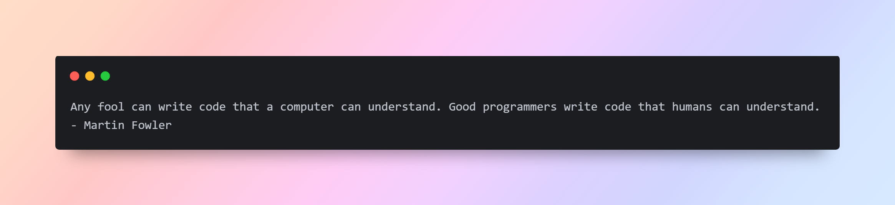

<h1 align="center">Hi 👋, I'm Ahmed</h1>

             

## 💫 About Me:
As a dedicated student at the Faculty of Computers and Artificial Intelligence, I’m diving deep into the exciting world of backend development with Node.js. Problem-solving is not just a skill for me—it’s my passion! I thrive on tackling complex challenges that spark my curiosity and fuel my drive to push the boundaries in algorithms and software development. 

## 💻 Tech Stack:

<!-- JavaScript --> 
 
<!-- Node --> 

<!-- Express --> 

<!-- React --> 

<!-- Bootstrap --> 

<!-- Github --> 
 
<!-- MySQL --> 

<!-- MongoDB --> 

<!-- # 💻 Tech Stack:
                
-->
 

## 📲 Contact me...

	
  
  <a href="https://wa.me/00201014821864?text=Hello,%20Let%27s%20developing%20and%20coding!">
  
  	
	
</a>

 

<!-- # 📊 GitHub Stats: -->
<!--   -->
<!--   -->
<!--   -->

<!--  -->

<!-- ## 🏆 GitHub Trophies

  -->

## ✍️ Random Dev Quote

 

 

